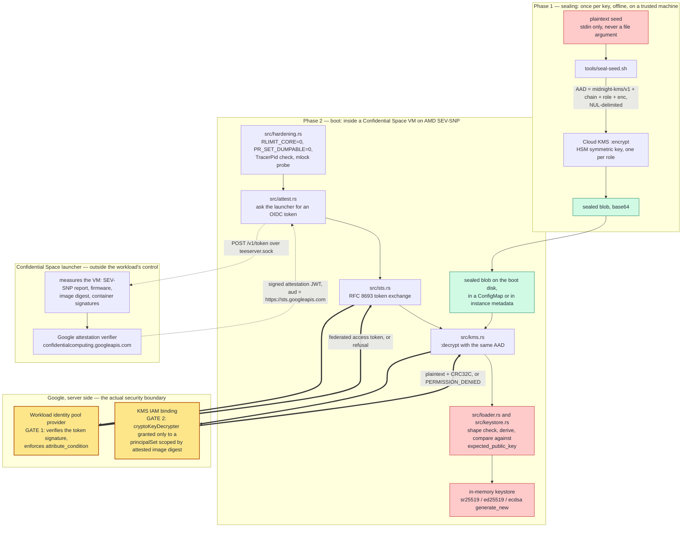
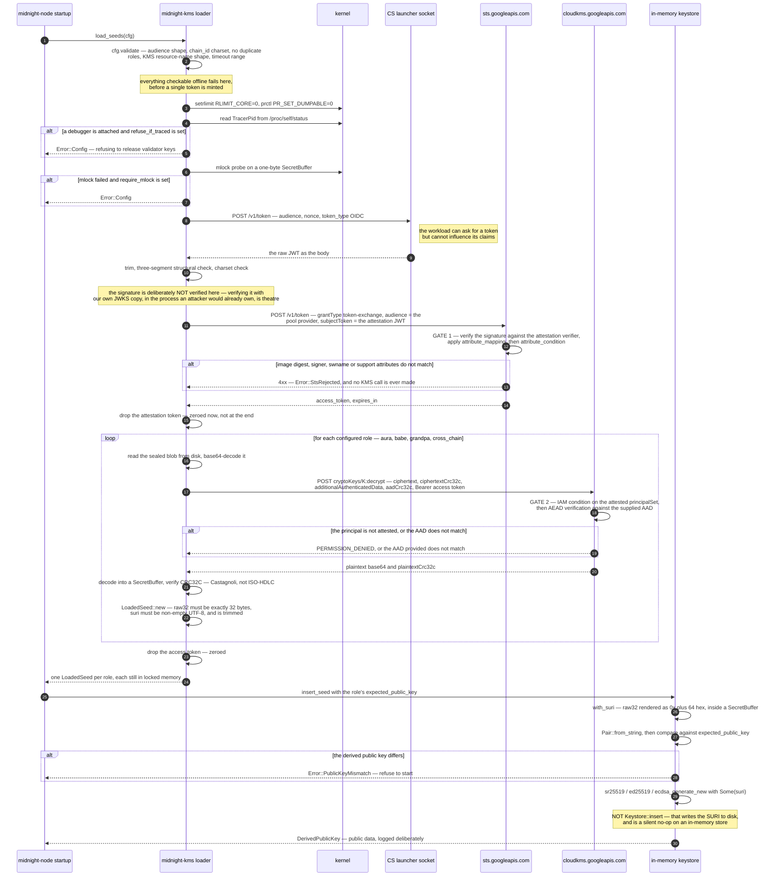
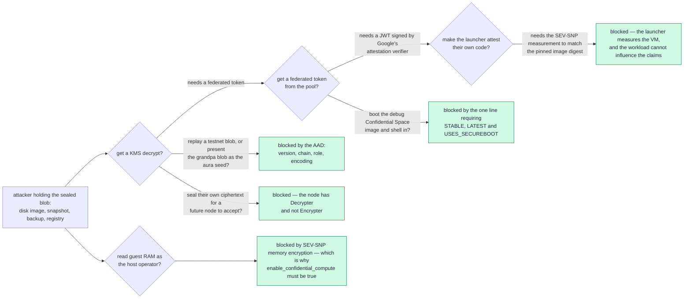
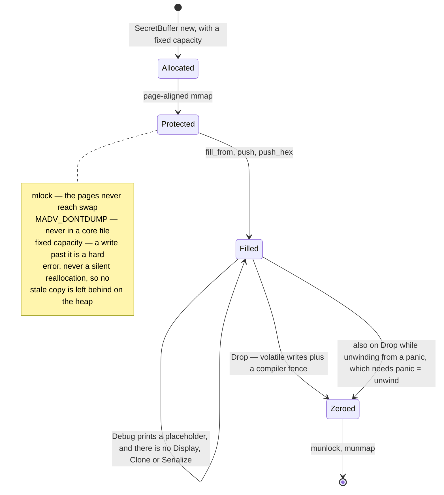
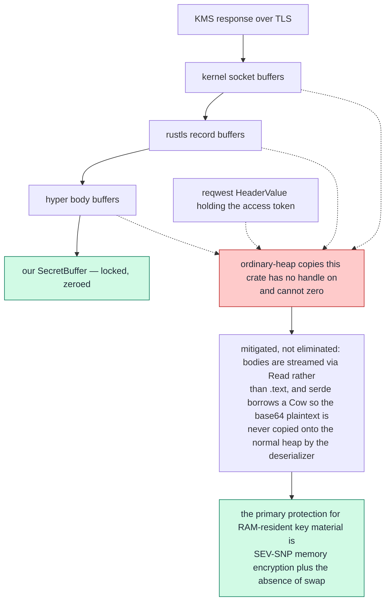
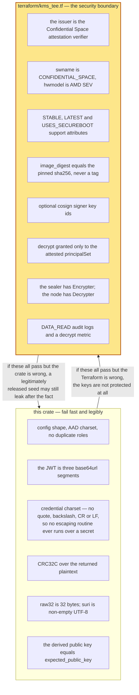

# midnight-kms

Attestation-gated release of midnight-node validator keys, using GCP
Confidential Space and Cloud KMS.

```
harden ──▶ attestation token ──▶ STS exchange ──▶ KMS decrypt ──▶ in-memory
(rlimit,    (launcher UDS,        (workload         (+ AAD,        keystore
 dumpable)   SEV-SNP measured)     identity pool)    CRC32C)
```

## The problem

`node/src/command.rs` reads each validator seed from a plaintext file
(`AURA_SEED_FILE` and friends) and inserts it into a `LocalKeystore` opened on
a path. `KeystoreInner::insert` writes the SURI straight back out to
`<base-path>/chains/<chain>/keystore/<hex>`, so each seed exists in cleartext
in two places on the boot disk. Anyone with read access to the disk, a
snapshot, or a backup has the validator's signing keys, and the current mainnet
Terraform runs with `enable_confidential_compute = false`, so the host operator
can read guest memory too.

## Why release, and not remote signing

The instinctive fix — leave the key in KMS and ask KMS to sign — is not
available. **Aura and BABE authority keys are sr25519**, which Cloud KMS does
not implement; its asymmetric signing covers RSA, ECDSA and Ed25519. A remote
signer is therefore impossible for the two consensus keys, and putting only
GRANDPA and the cross-chain key behind a signer would leave the
block-production key exposed anyway.

So the private key must exist in the node's address space, and the real
question is *who is allowed to obtain it*. Seeds are sealed as Cloud KMS
ciphertext, and the key's IAM policy releases `decrypt` only to a workload
whose Confidential Space attestation matches a pinned container image digest.
The sealed blob then needs no protection of its own — it is inert without an
attested decrypt — so it can sit on the boot disk, in a ConfigMap, or in
instance metadata.

## How it works

Two phases that never overlap, in time or in identity. An operator **seals** a
seed once, offline, with an identity that can encrypt and not decrypt. The node
**releases** it at every boot, with an identity that can decrypt and not
encrypt — and only for as long as it can prove what it is running.



Red is plaintext key material, green is data that needs no protection of its
own, amber is where the decision is actually made. Both amber boxes are
Terraform, not Rust.

### The boot path, call by call



### What an attacker has to defeat



Every one of those stops is enforced by `terraform/kms_tee.tf` or by the
hardware, and none of them by this crate. What the crate contributes is that a
seed which *has* been released legitimately does not then leak sideways.

### The life of one secret



Every secret in the crate takes that path — the attestation JWT, the STS access
token, the raw HTTP response bodies, the decrypted seed, and the hex SURI handed
to the keystore — and they are dropped as early as each one can be:

```mermaid
gantt
    title Secret lifetimes within load_seeds — the axis is step order, not seconds
    dateFormat X
    axisFormat %s
    section attestation
    attestation JWT, dropped as soon as STS answers :0, 3
    section credentials
    STS access token, dropped once every seed is in hand :3, 8
    section key material
    raw HTTP response bodies :4, 5
    decrypted seed, held in locked memory :5, 9
    hex SURI, alive only inside the with_suri closure :9, 10
```



### What is not on that path



### Where each check lives



## Where the security actually lives

**In `terraform/kms_tee.tf`, not in this crate.**

Every local check in `src/attest.rs` is fail-fast diagnostics. Code running
outside a TEE could return whatever it liked from those functions; verifying
the attestation JWT's signature client-side would be theatre, since we would be
trusting our own copy of Google's JWKS fetched by the same process an attacker
would already control. What an attacker cannot do is make the workload identity
pool accept a token it did not issue, or make KMS release a key to a principal
whose attested image digest does not match the IAM condition.

Review the Terraform as if it were the key material. In particular the
`attribute_condition` line requiring `USES_SECUREBOOT` and `STABLE` support
attributes: without it, an operator could boot the *debug* Confidential Space
image, which permits an interactive shell into the VM, and read the seeds out
of the node's memory.

## Is zeroization needed?

Yes — with a clear-eyed account of what it buys, because it is easy to
over-trust.

### What is zeroized

`SecretBuffer` (`src/secret.rs`) is a **fixed-capacity, page-aligned,
`mlock`ed** allocation, volatile-zeroed before it is freed. Everything secret
lives in one: the attestation JWT, the STS access token, the raw HTTP response
bodies, the decrypted seed, and the hex SURI handed to the keystore.

Fixed capacity is the point. `zeroize`'s own `Vec` impl carries the caveat
*"Cannot ensure that previous reallocations did not leave values on the heap"* —
and a growing `Vec` copies its contents to a new allocation and frees the old
one **without zeroing it**. Reading an HTTP body into a `Vec` does that
repeatedly. So `SecretBuffer` never reallocates: a write past capacity is a
hard error, never a silent regrow.

On top of that:

* `mlock(2)` — pages cannot be written to swap.
* `MADV_DONTDUMP` + `RLIMIT_CORE=0` + `PR_SET_DUMPABLE=0` — excluded from core
  dumps, and `/proc/<pid>/mem` becomes unreadable by a same-uid process.
* Zeroing uses `zeroize`, i.e. volatile writes plus a compiler fence. Never
  hand-roll `for b in buf { *b = 0 }`: LLVM is entitled to delete a plain
  memory write to an allocation that is about to be freed, and does.
* Secret types implement a redacted `Debug` and no `Display`, `Clone` or
  `Serialize`, so a struct that contains one stays safe to log.
* Zeroization is RAII, so it runs while unwinding from a panic. This depends on
  the workspace's `panic = "unwind"`; under `panic = "abort"` destructors are
  skipped and this protection silently disappears.

### What is *not* zeroized — residual exposure

Once a seed has passed through **rustls' TLS record buffers, hyper's body
buffers, and kernel socket buffers**, copies exist on the ordinary heap that
this crate has no handle on and cannot zero. `reqwest`'s `HeaderValue` also
keeps an unzeroable copy of the access token.

This is unavoidable for *any* design in which a network service returns
plaintext, and Cloud KMS is such a service. It is mitigated but not eliminated:
bodies are streamed via `Read` into our own buffers rather than through
`.text()`/`.bytes()`, and responses are parsed with `serde`'s borrowed
`Cow<'a, str>` so the base64 plaintext is never copied onto the normal heap by
the deserializer.

**So the honest framing is:** zeroization here is defence-in-depth against
*post-hoc* disclosure — a heap-overread bug, a stray core file, a page reaching
swap. The primary protection for key material resident in RAM is SEV-SNP
memory encryption plus the absence of swap in the Confidential Space image. If
you are relying on zeroization as your main defence, the design is wrong.

An envelope layer (KMS unwraps a DEK, local AES-GCM unwraps the seed) would not
help: the DEK is exactly as sensitive as the seed and arrives over the same
channel. It was rejected in favour of `additionalAuthenticatedData`, which
provides the only real benefit — domain separation — with no hand-written AEAD
code. See the module docs in `src/kms.rs`.

## Other hardening worth knowing about

* **Redirects are refused** (`Policy::none()`). Every request carries a bearer
  token; following a redirect would forward the `Authorization` header, or the
  attestation JWT in the STS body, to whatever host the redirect named.
* **Proxies from the environment are ignored** (`no_proxy()`), so setting
  `HTTPS_PROXY` cannot interpose on the key-release path.
* **Endpoints are pinned** and KMS resource names are shape-validated, so
  config cannot smuggle a query string or a traversal into the request URL.
* **One attestation audience.** Both token sources (launcher socket and
  pre-minted file) carry `aud = https://sts.googleapis.com`, the single value
  the Terraform provider's `allowed_audiences` lists. Which *pool* the token is
  exchanged against is bound by the STS `audience` parameter, so scoping the
  JWT's `aud` to the pool would add nothing but a second value to keep in sync.
* **Credentials are charset-validated** before being interpolated into a JSON
  body or an HTTP header. Refusing quotes, backslashes, CR and LF means neither
  interpolation can be broken out of, so no escaping routine ever has to run
  over a secret.
* **The CRC32C the KMS response carries is verified.** Skipping it would let a
  flipped bit in transit become a silently wrong seed — and a wrong Aura seed
  means a validator that signs things nobody accepts. Implemented by hand
  because the polynomial matters: `crc32fast` is CRC-32/ISO-HDLC, not
  Castagnoli, and would disagree with KMS on every response. Checked against
  the RFC 3720 vectors.
* **`additionalAuthenticatedData` binds each blob to one (version, chain, role,
  encoding)**, so a GRANDPA blob cannot be presented as the Aura seed and a
  testnet blob cannot be replayed into a mainnet validator sharing a key ring.
  The bytes are a wire format, pinned by a cross-language contract test
  (`tests/aad_contract.rs`) against `tools/seal-seed.sh` — a drift there would
  otherwise surface only as an opaque "the AAD provided does not match" at
  validator startup.
* **`expected_public_key` is enforced before insertion.** The three ways this
  can go wrong — a swapped ciphertext blob, a role mapped to the wrong key, a
  BIP39 phrase sealed as `raw32` — all yield a *valid but wrong* authority key.
  A node that boots with the wrong key does not fail loudly; it just signs
  things nobody accepts. Better to refuse to start.
* **The sealer identity has `Encrypter` and not `Decrypter`**; the node has
  `Decrypter` and not `Encrypter`. An operator who seals a seed cannot read any
  sealed seed back, and a compromised node cannot mint ciphertext a future node
  would accept.

## The `raw32` / `suri` trap

`SeedEncoding::Suri` exists for a reason that is easy to miss. Substrate runs a
BIP39 phrase through PBKDF2, so `Pair::from_string(phrase)` and
`Pair::from_seed(raw_entropy)` produce **different keypairs**. A validator
already registered with a phrase-derived public key therefore cannot switch to
`raw32`: sealing the phrase's raw entropy would silently produce a different,
wrong authority key. Prefer `raw32` for new keys; keep `suri` for existing
ones. `tests/../keystore.rs` pins both behaviours.

## Layout

| path | |
|---|---|
| `src/secret.rs` | locked, non-reallocating, volatile-zeroed buffer |
| `src/hardening.rs` | `RLIMIT_CORE`, `PR_SET_DUMPABLE`, ptrace check |
| `src/attest.rs` | Confidential Space token (UDS, file fallback) |
| `src/uds.rs` | minimal HTTP/1.1 over the launcher's Unix socket |
| `src/sts.rs` | RFC 8693 token exchange |
| `src/kms.rs` | Cloud KMS `:decrypt` + AAD + CRC32C |
| `src/config.rs` | roles, encodings, validation, AAD construction |
| `src/loader.rs` | orchestration; `LoadedSeed::with_suri` |
| `src/keystore.rs` | Substrate adapter (`--features substrate`) |
| `terraform/kms_tee.tf` | **the security boundary** |
| `tools/seal-seed.sh` | one-time sealing, stdin only |
| `integration/README.md` | the midnight-node patch |

## Status

74 tests pass (`cargo test --features substrate`); the core builds with no
Substrate dependency. **Not yet run against real GCP infrastructure** —
the attestation → STS → KMS path is exercised only against golden fixtures, so
the Terraform and the end-to-end flow need a preview-environment run before
this goes anywhere near mainnet.
